# Administrative platforms
{: .no_toc }

  

    Table of contents
  

  {: .text-delta }
1. TOC
{:toc}

The platform you will be using is different if you are affiliated with CNRS or ENS. If you don't know exactly, you can ask Philippe but here are some general rules (however, there might be exceptions to those):
- permanent members (managers) are affiliated to CNRS.
- postdocs, doctoral students and interns are usually affiliated to ENS.

## CNRS

To access CNRS platforms, you will need 'sesame' credentials. If this is your first connection, go [here](https://sesame.cnrs.fr/){:target="_blank"}, this assumes your email address has already been recorded by the human ressources team.

### Record your work time

Depending on the nature of your contract, you may have to record your work time or not. Ask Philippe or Radhia if you need to do this.

At the end of every month (before the 7th of the next month), you will need to record your worked and absence days. You should be reminded of that task by an email when the time comes.
You need to use the [tempo](https://tempo.cnrs.fr){:target="_blank"} website. Log in using your sesame credentials.

- Click on the corresponding month
- Select your activity for each day (there is a field at the bottom of the page to affect all selected rows and save you some time).
- Send for validation with the 'Signer et envoyer pour validation' button. Make sure the information is correct before sending it!

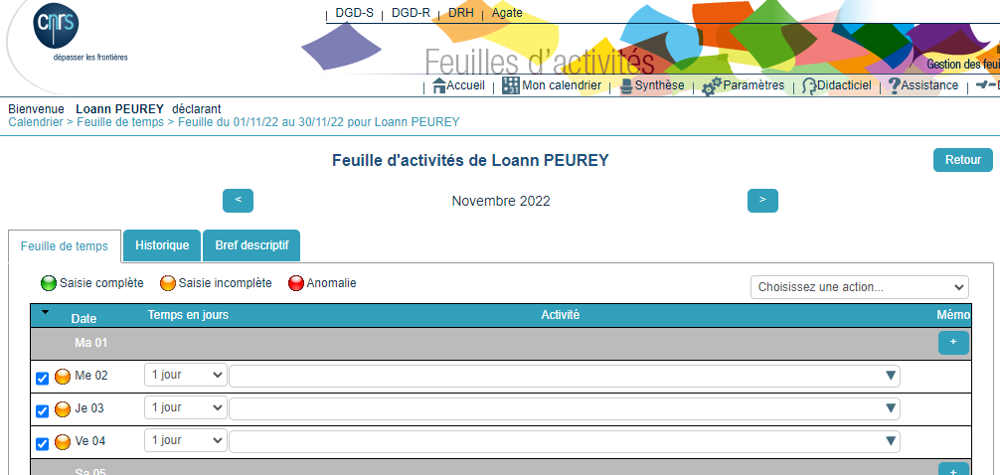

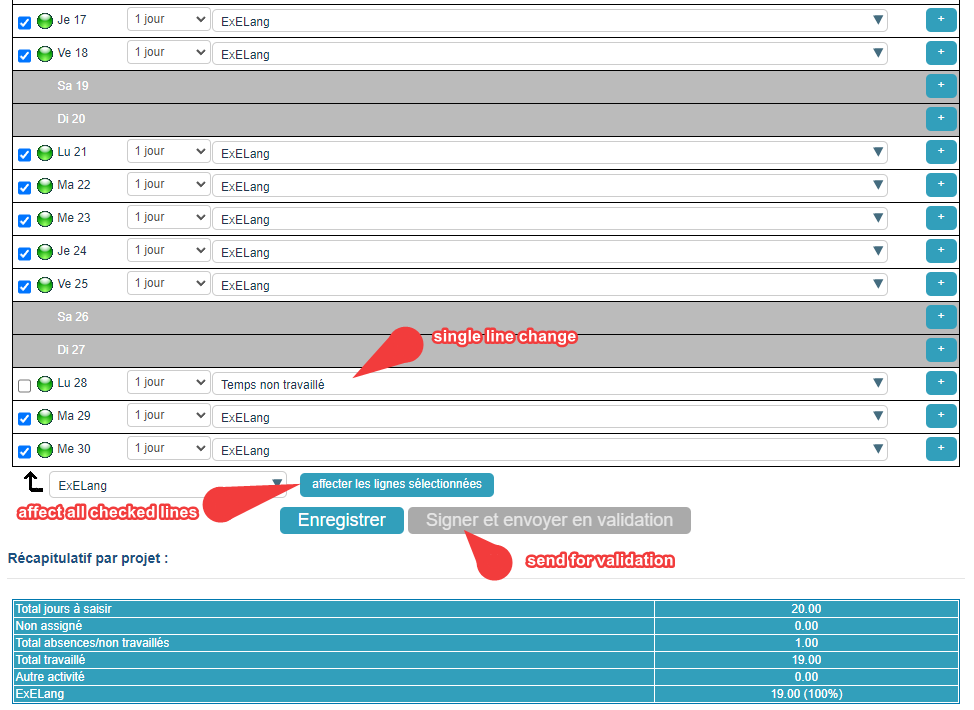

### Request leave (both missions/personal time off/others)

The CNRS uses the [agate-tempo](https://agate-tempo.cnrs.fr){:target="_blank"} platform. Log in with your sesame credentials.
You can see your balance of paid leave in the 'Compteur(s)' tab.

To send a new request:
- In the 'Absences' section
- select the 'Nouvelle demande' tab
- choose the motive ('mission' or 'formation' time will not be deducted from yout balance)
- Enter the dates (morning and afternoons are counted, so for examle if you only take full days, in the start date select morning and in the end date select afternoon)
- Validate with 'Enregistrer'

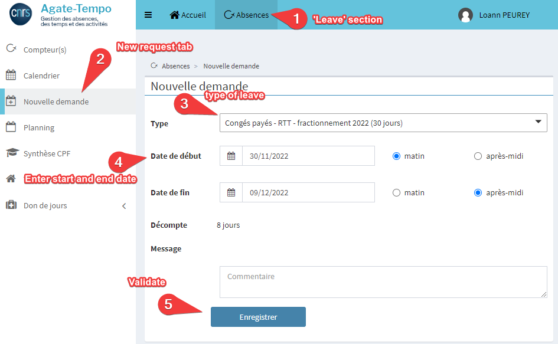

### Teleworking

Teleworking involves two steps

1. Get a teleworking permission. This requires some paperwork and can be quite long to be accepted. You have to log into the [ariane](https://ariane.cnrs.fr/){:target="_blank"} website (with sesame credentials). Then the request is made [here](https://cnrs.employee.eu.people-doc.com/request-forms/premiere-demande-d-autorisation-de-teletravail-copie-1){:target="_blank"}. A lot of information and some paperwork is needed so please talk this through with Alex.

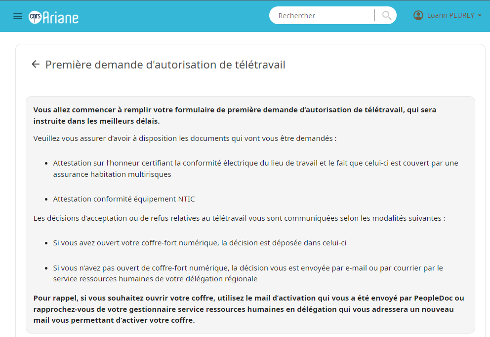

2. Declare your teleworked days using [agate-tempo](https://agate-tempo.cnrs.fr){:target="_blank"} (woth sesame credentials). In the 'Absences'section, click the 'Télétravail' tab, select 'Nouvelle demande'. Then enter the start and end date and validate (you can select 'periodique' for recurring telework days).

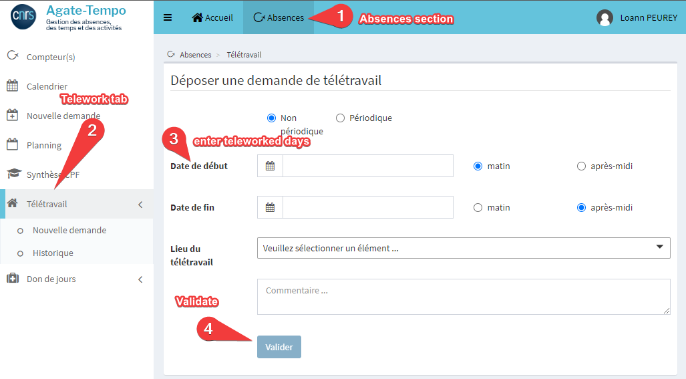

## ENS

ENS uses the HAMAC platform, to access it, go to the 'environnement numérique de travail' of the ENS [here](http://ent.ens.fr){:target="_blank"}. Click the 'Connexion' button on the right of the page and enter your ENS credentials.
Then in the 'Services' tab, click on 'Hamac'.

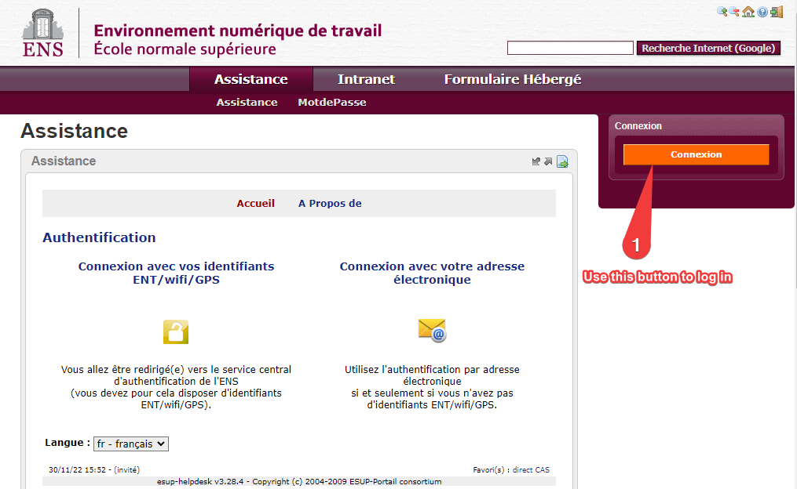

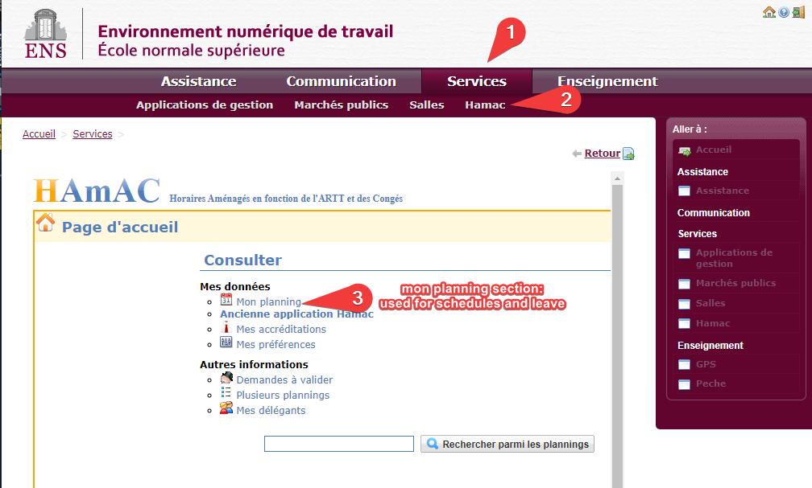

### Define schedule

In order to ask for leave days, you first need to have a schedule defined and validated by your superior.

- Go into 'mon planning'
- Select the corresponding academic year.
- Click the 'horaires' category and 'Saisie d'un nouvel horaire'
- Give a name to your new schedule (e.g. horaire ens)
- Enter your worked time for each day of the week. We advise to give a length of 3h45 for worked hours in mornings and afternoons and 7h30 each worked day to avoid taking only fractions of days/half-days when asking for leave time (as Hamac calculates leave time based on 1day=7h30 and 1/2day=3h45).
- Save the schedule (bottom left corner)

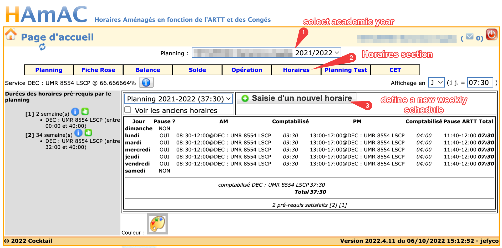

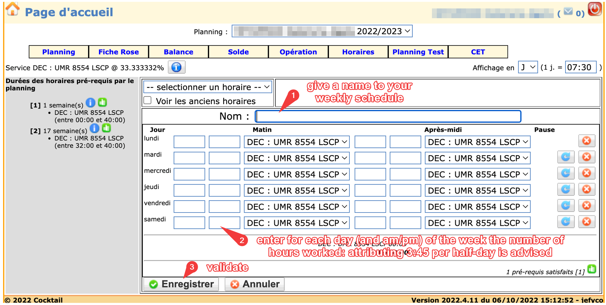

Now that you have a schedule created, you need to tell the system to use it for the duration of your work here:
- Select the 'planning' category
- Click on the week you start your work an ENS.
- Choose your newly created schedule in the drop-down list
- Check all the weeks you will be working here
- Validate with the green checkmark

You can now send your schedule for validation to your superior, to ask for validation, click on the 'Demande de validation' button (in the 'Planning' section).

You will be able to ask for leave days when the schedule is validated.

### Leave days

Please note that to ask for leave days, you first need to have a [validated schedule](#define-schedule).

- In the Hamac platform, click 'mon planning'
- Click on the day your leave starts
- Choose a motive for your request (personal leave is 'congé annuel', for justified leave, choose the reason in the drop-down list, the validation process will usually need proof to be accepted)
- Select the end date (if it is different of the start date)
- Validate your request

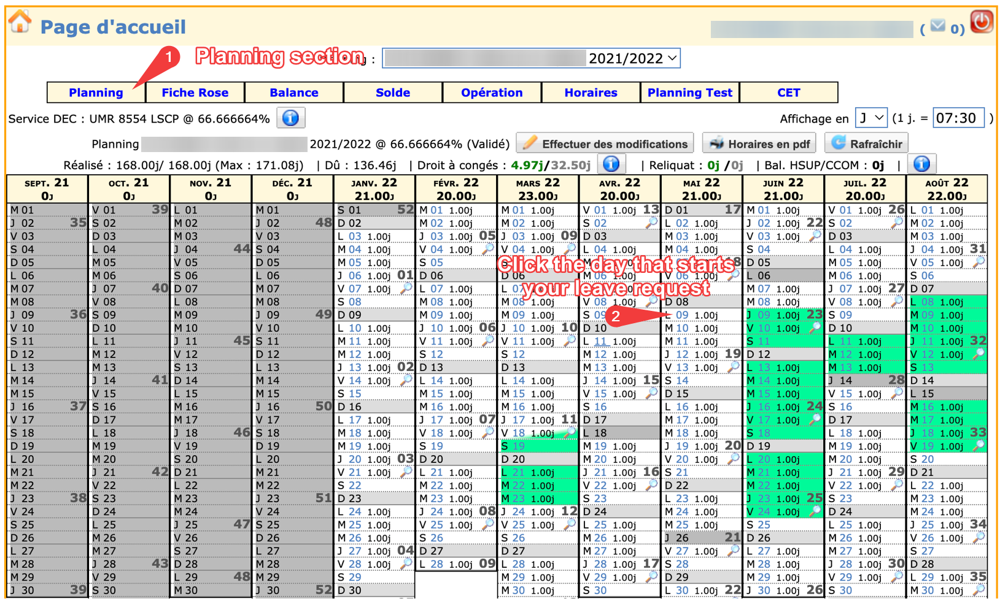

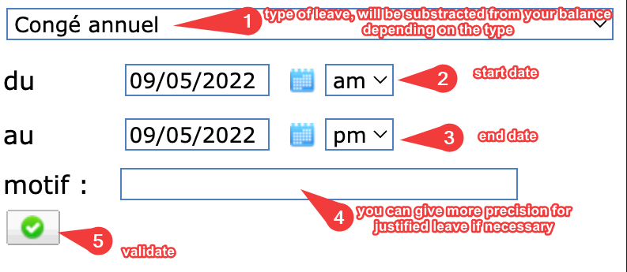

### Additional resources

You can read the 'quite old and only in french' excel version of how to use hamac for more detailed information [here](../ressources/misc/guide-pratique-hamac.xls)