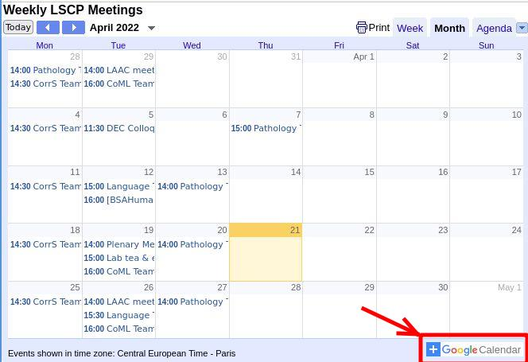

# Communication
{: .no_toc }

  

    Table of contents
  

  {: .text-delta }
1. TOC
{:toc}

## Language

Lab language is English (including scientific meetings).
Depending on who is involved, discussion may also be in French sometimes. For administrative matters involving Isabelle Brunet, Anne-Caroline Fiévet, or Radhia Achheb, they'll prefer being spoken to in French. For technical matters involving Vireack Ul or Michel Dutat, they'll also prefer French. Everyone understands English though!

## Mattermost

We use [mattermost](https://mattermost.cognitive-ml.fr/login/){:target="_blank"} as a way to discuss in the team on a daily bases. You should have created an account as part of your onboarding. If you do not see the LAAC and LSCP teams, ask Loann to add you. Depending on your topic, you may also want to ask to be added to the CoML team.

## Meetings

If you are an intern, you'll typically join a weekly meeting with Alex. If you don't already have one scheduled, please remind her via mattermost!

Once you're on the mailing lists, you should receive a schedule of the upcoming meetings every week.

We have group meetings every Tuesday.

Typically on the first Tuesday of each month, a plenary meeting for the whole lab takes place, 2-3:30 (including social time).

On the second Tuesday of each month, we currently have a meeting on Benchmarking human and machines' speech perception (4-5pm). 

The other Tuesdays, we usually have a team meeting where we discuss various topics and where people can present their work (2-3pm). This is the perfect place to share news (did you get an abstract accepted somewhere? did you apply for a PhD program? etc) and ask general questions (what are some good books on the topic to read?).

Other teams in the lab, like the CoML team for example, have their own meeting. You may want to attend some of them occasionally.

The LSCP calendar, including all the meetings mentioned above, is available [here.](https://calendar.google.com/calendar/embed?src=vsvnk7q30d9h9lj866g25m98ok%40group.calendar.google.com&ctz=Europe%2FParis){:target="_blank"}

---

The department (DEC) is hosting a lot of events and seminars. The DEC calendar is available [here.](https://calendar.google.com/calendar/embed?src=07im0e9urm3sh8tlmoeqde2drk%40group.calendar.google.com&ctz=Europe%2FParis){:target="_blank"}

You can easily add those calendar to your personal google agenda by clicking on the button at the bottom right of the page:

## When you need something:

- go to the list of key contacts in the [welcome page](../index.md)

- as much as possible use mattermost, which we check a lot more often than email. Nearly everyone is on it! Use direct messages to individuals for anything super-specific or private. For things related to your project, prioritize using the channel that is created for it. You should also feel free to post general questions in the public channels (at the team or lab level)

- for emergencies, you can also drop by Alex’ office (mezzanine above 406) or call 06 60 63 89 41 -- but please think if you need a response super quickly, or you can wait. The preference is for asynchronous mattermost communication!
