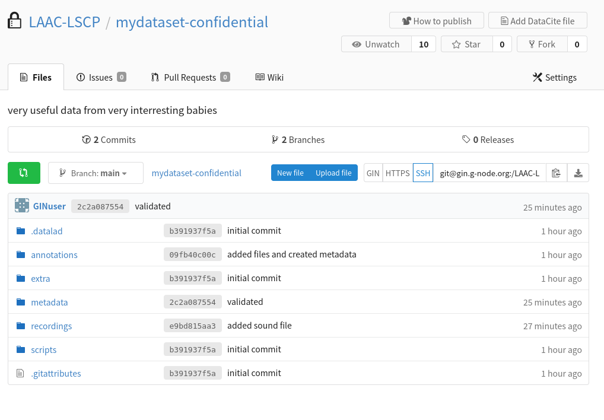
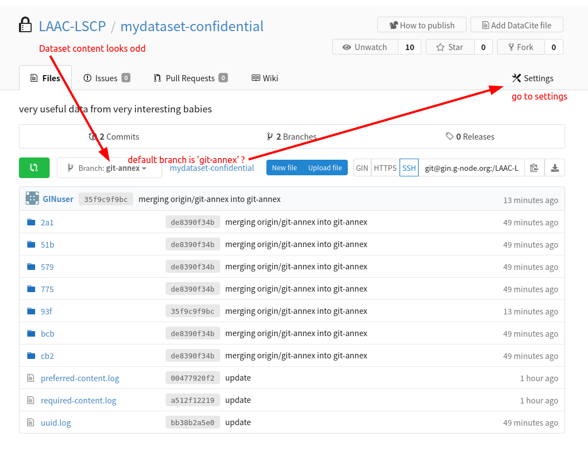
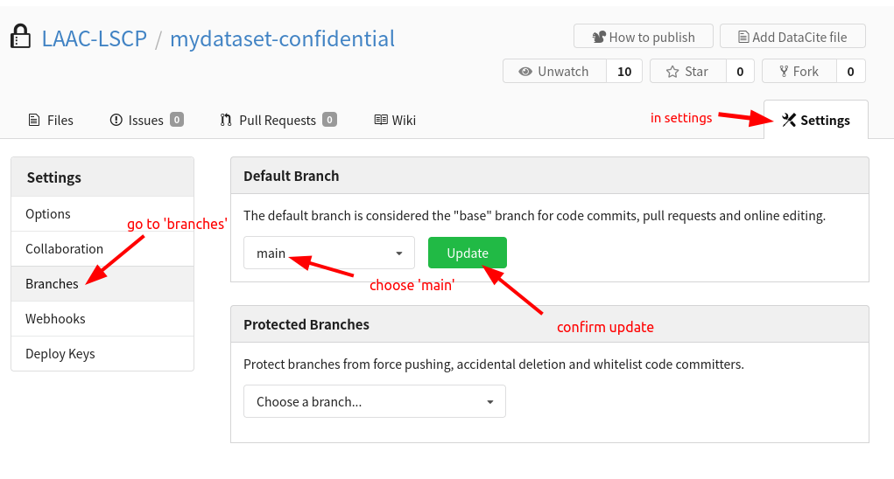

# Creating a Dataset and publishing it to GIN
{: .no_toc }

This page is here to help you create a new Dataset following the ChildProject structure using data that has not been organized this way yet. 

<details open markdown="block">
  <summary>
    Table of contents
  </summary>
  {: .text-delta }
1. TOC
{:toc}
</details>

## Prerequisites

In order to follow this guide, you will need to have childproject installed along with datalad and git-annex. If that is not the case, follow the [installation instructions](https://childproject.readthedocs.io/en/latest/install.html#installation){:target="_blank"}. You most likely will run it in a conda environment, so make sure it is activated:
```bash
conda activate childproject
```

We use [GIN](https://gin.g-node.org/){:target="_blank"} as an online platform for storing our repositories. To publish your dataset, you will need a GIN account that has writing permissions for your dataset. You should have created an account already, if not do it [here](https://gin.g-node.org/user/sign_up){:target="_blank"}. Once you have an account, Loann/Alex should give you writing permissions on a dataset within the LAAC-LSCP organization.
For every new computer that you will use to push updates to your dataset, You have to register an SSH key to allow SSH access (you can find an explanation of what SSH keys are and how you can create one in this [tutorial](https://docs.github.com/en/authentication/connecting-to-github-with-ssh/about-ssh){:target="_blank"}). You only need to do this once per computer, and it'll be set for all of your datasets & forever. To set SSH access, visit the [settings of your user account](https://gin.g-node.org/user/settings/ssh){:target="_blank"}. In the “SSH Keys” tab, click the button “Add Key”:

Give the key an informative name that will allow you to remember what computer it belongs to (eg “oberon-lpeurey”).

## Preparing a GIN repository

We are going to need a new repository on GIN where we will store our dataset and manage people's access to it once it is ready to be shared.
Inside the lab, we regroup our datasets in the LAAC-LSCP GIN organization, so the dataset should be created there. If you have the permissions necessary to create a new repository for the organization, follow the steps in the attached figure. If you are an intern, discuss with Alex/Loann of your need of a new repository.
Unless your dataset is public (e.g. from CHILDES), you'll need 3 levels of access:
- confidential => data that is never shared, usually personal information that is not useful anyway for analysis (e.g. names)
- collaborators => data that is shared with collaborators when we grant them access to the data, usually under NDA (e.g. recordings, transcriptions)
- public => data that can be accessed by anybody, completely anonymous so no audio, no transcription, no personal metadata (e.g. converted automated annotations).

To create those levels of access, create 3 **empty** repositories in your GIN organization: `<dataset-name>` , `<dataset-name>-public` and `<dataset-name>-confidential`, e.g. `mydataset` , `mydataset-public` and `mydataset-confidential`.
If your dataset is public, then you can create a single repository that will be public.


## Creating the base structure and datalad repository

### Installating the procedures

To create your new dataset, we will borrow some help from the `datalad-procedures` code which was created for this specific pupose. If you have already created a dataset in the past, your procedures may already be set up. 
To check your available templates, run `datalad run-procedure --discover` and explore the outputted list:
```
cfg_laac1 (/my/conda/env/lib/python3.6/site-packages/datalad/resources/procedures/cfg_laac1.py) [python_script]
cfg_yoda (/my/conda/env/lib/python3.6/site-packages/datalad/resources/procedures/cfg_yoda.py) [python_script]
cfg_el1000 (/my/conda/env/lib/python3.6/site-packages/datalad/resources/procedures/cfg_el1000.py) [python_script]
cfg_text2git (/my/conda/env/lib/python3.6/site-packages/datalad/resources/procedures/cfg_text2git.py) [python_script]
cfg_metadatatypes (/my/conda/env/lib/python3.6/site-packages/datalad/resources/procedures/cfg_metadatatypes.py) [python_script]
cfg_laac2 (/my/conda/env/lib/python3.6/site-packages/datalad/resources/procedures/cfg_laac2.py) [python_script]
cfg_laac (/my/conda/env/lib/python3.6/site-packages/datalad/resources/procedures/cfg_laac.py) [python_script]
```

If you spot `cfg_laac1`, `cfg_laac2`, `cfg_laac` and `cfg_el1000` in the list, you are already good to go and can skip to the [next section](#using-templates). If they are not here, we will have to install them. To do so, clone the repo (or navigate to it if you already have it) and launch the installation :
```bash
git clone git@github.com:LAAC-LSCP/datalad-procedures.git
cd datalad-procedures
pip install -r requirements.txt
python install.py
```
At this point, a message may ask you if you want to establish a fingerprint; say yes.

Check again the available templates with `datalad run-procedure --discover`.
You should now have `cfg_laac1`, `cfg_laac2`, `cfg_laac` and `cfg_el1000` in the outputted list.

### Using templates

We will concentrate on using the laac template which is the one we will use most of the time. You can read more about that configuration and the other templates available in [the repo](https://github.com/LAAC-LSCP/datalad-procedures){:target="_blank"}.

With the next set of commands, we prepare the necessary parameters by setting the GIN organization you will use and wether to create a confidential and public sibling or not. If you use a confidential sibling, make sure you created 2 repositories on GIN at [the previous step](#preparing-a-gin-repository)
```bash
export GIN_ORGANIZATION='LAAC-LSCP' # name of the GIN organization
export CONFIDENTIAL_DATASET=1 # set to 0 if there should not be a confidential sibling
export PUBLIC_DATASET=1 # set to 0 if there should not be a confidential sibling
```
Now we can create the actual datalad repository, the procedure used will build the file structure according to [ChildProject standards](https://childproject.readthedocs.io/en/latest/format.html){:target="_blank"}. First change directory to where you want your new dataset created, then create it. Replace `mydataset` by the name of your GIN repository.
```bash
cd /path/to/a/folder #change directory
datalad create -c laac mydataset
```

The output you'll see looks something like this:
```
[INFO   ] Creating a new annex repo at /scratch2/lpeurey/datasets/mydataset/
[INFO   ] Scanning for unlocked files (this may take some time) 
[INFO   ] Running procedure cfg_el1000 
[INFO   ] == Command start (output follows) ===== 
[INFO   ] Could not enable annex remote origin. This is expected if origin is a pure Git remote, or happens if it is not accessible. 
[WARNING] Could not detect whether origin carries an annex. If origin is a pure Git remote, this is expected.  
.: origin(-) [git@gin.g-node.org:/LAAC-LSCP/mydataset.git (git)]
.: origin(+) [git@gin.g-node.org:/LAAC-LSCP/mydataset.git (git)]                       
[INFO   ] Could not enable annex remote confidential. This is expected if confidential is a pure Git remote, or happens if it is not accessible. 
[WARNING] Could not detect whether confidential carries an annex. If confidential is a pure Git remote, this is expected.  
.: confidential(-) [git@gin.g-node.org:/LAAC-LSCP/mydataset-confidential.git (git)]
.: confidential(+) [git@gin.g-node.org:/LAAC-LSCP/mydataset-confidential.git (git)]    
[INFO   ] Configure additional publication dependency on "confidential"         
.: origin(+) [git@gin.g-node.org:/LAAC-LSCP/mydataset.git (git)]
[INFO   ] == Command exit (modification check follows) ===== 
create(ok): /scratch2/lpeurey/datasets/mydataset/ (dataset)
```

The procedure should also carry out the first push to your remote repository(/ies). You should have a look to the online page of your repo on GIN (eg https://gin.g-node.org/LAAC-LSCP/mydataset-confidential)


The content looks odd?
{: .label .label-yellow }
Your default branch may be set to 'git-annex', change this in the settings:



## Organizing raw data

go into your new dataset : `cd mydataset`

Your dataset has been created, configured and linked to GIN. But for now,
it has no contents.
The next step is thus to add raw data to the dataset in the right place.

There are two possibilites (depending on whether you created a confidential repository or not):
 1. Some data are confidential and should only be accessible from `<your-dataset>-confidential`
 2. All data can be included in the main version of the dataset

### How confidential data is organized and stored

Here is the rule: every file that is a descendant of a `confidential` folder will be restricted
to users that have read access to `<your-dataset>-confidential`; any other file will
be shared with all users who have read access to your dataset.

Here are a few examples:

#### Files that would be confidential

 - `metadata/confidential/whatever.csv`
 - `annotations/its/confidential/raw/something.its`
 - `annotations/its/confidential/converted/something.csv`
 - `annotations/eaf/confidential/raw/some/annotation.eaf`

#### Files that will not be

  - `metadata/somefile.csv`
  - `annotations/its/raw/something.csv`

It is therefore crucial to organize your data in the right place depending on its level of sensitivity.

### What is considered public data

By default, we only consider automated converted annotation files to be public. We assume they are stored in the standard set we use:
  - vtc
  - vcm
  - its
  - alice
  - alice/output

#### Files that would be public

 - `annotations/its/converted/something.csv`
 - `annotations/its/converted/subfolder/something.csv`
 - `annotations/vtc/converted/something.csv`
 - `annotations/alice/output/converted/annotation.csv`

#### Files that will not be

  - `annotations/its/raw/something.csv`
  - `annotations/cha/converted/something.csv`
  - `recordings/raw/rec1.wav`
  - `annotations/alice/output/converted/confidential/annotation.csv`

### Audio files

#### Original recordings

Your original audio files should always be stored under `recordings/raw`.
You will likely want derived versions of them, depending on the format, codec, sampling rate, number of channels used for those files. We use wav files sampled at 16kHz mono channel with codec pcm_s16le as our standard. This is to make sure we can apply our usual models to them and read their content correctly.
You are strongly encouraged to do that [conversion using childproject](https://childproject.readthedocs.io/en/latest/processors.html#basic-audio-conversion){:target="_blank"} **once you have finished creating the dataset** as the automatic conversion relies on the dataset already being organized and passing the childproject validation.

#### Splitting LENA recordings

the LENA software outputs audio files that can sometimes contain multiple *sessions*. This means that in a single audio file, you will find that the recording is sometimes stopped and restarted at a different hour.
ChildProject is built on the assumption that every audio file is a single continuous recording with a single starting time. If you have lena audios that contain multiple sessions, you will have to split them into different files. This should be done directly in `recordings/raw` and before any audio conversion because that will change the number of audio files and subsequently the recordings index in `metadata/recordings.csv` which needs to be unique. You can however store the original lena files in a different folder such as `recordings/lena_output` for the sole purpose of keeping your original data.

We recommend you use this [script](../ressources/scripts/split_lena_recordings.py){:target="_blank"} to split the recordings. Run it from the root of the dataset.
Warning
{: .label .label-yellow }
The script relies on the `metadata/recordings.csv` file to know where to split. You should [create the metadata from the its files](#create-the-metadata-from-the-its-information) **before** splitting the files.
```python
"""
This script splits the audio files outputted by lena that contains multiple days of recording.
Based on recordings.csv, splits audio that is linked to the same .its file into separate audio files by using the durations.
"""
from ChildProject.projects import ChildProject 
from pydub import AudioSegment
import os

audio_path = 'recordings/lena_output'

project = ChildProject('.')
project.read()

#regroup recordings by the original lena output(as the its file)
for its, recordings in project.recordings.groupby('its_filename'):
    #print(recordings)
    #print(session)
    
    recordings['position'] = recordings['duration'].cumsum().shift(1, fill_value = 0)
    
    input_audio = os.path.join(audio_path, its[:-4] +'.wav')
    if not os.path.exists(input_audio):
        #print(f"{input_audio} does not exist")
        pass

    audio = None

    for recording in recordings.to_dict(orient = 'records'):
        on = recording['position']
        off = recording['position']+recording['duration']

        print("audio : {} -> {} - {} -> {}".format(input_audio, on, off,recording['recording_filename']))
    
        if audio is None:
            audio = AudioSegment.from_file(input_audio)
        
        try:
            audio[on:off].set_sample_width(2).export(
                project.get_recording_path(recording['recording_filename']),
                format = 'wav',
                bitrate = '16k'
            )
        except Exception as e:
           print("failed to extract {}: {}", recording['recording_filename'], str(e))
```

Saving and publishing audio files
{: .label .label-yellow }
After preparing correctly your audio files, it is time to save your changes again with
```bash
datalad save -m 'audio data'
```
However be cautious with pushing your changes online because the audio data can be extremely large and the uploading really long. If you have access to a cluster/server running continually, consider doing the upload from there with a job, allowing you to log out while the upload continues. Otherwise, you can choose to run the push bits by bits by running the command `datalad push recordings/raw/rec1.wav` on your different audio files one by one.

### Original Metadata

The original metadata is likely to contain sensitive information, so if you have a confidential sibling, it should be restricted to the `confidential` version of the dataset.
Therefore, most of the time, your original metadata should lie in `metadata/confidential/original`. Otherwise, store it in `metadata/original`.

```bash
# cd to your dataset
cd <your-dataset>

# create an empty folder for the original metadata
mkdir -p metadata/confidential/original
```

### LENA annotations

.its annotations contain information that may be used to identify the participants (such as their date of birth). So you should consider storing them as confidential.

```bash
# create an empty folder for the .its
mkdir -p annotations/its/confidential/raw
```

Your .its files should be saved at the root of `annotations/its/confidential/raw` or `annotations/its/raw` depending on if they are to be kept confidential or not.

If you stored them as confidentiel, an anonymized version of the .its should be created. This is done with the [ChildProject package](https://childproject.readthedocs.io/en/latest/annotations.html#its-annotations-anonymization){:target="_blank"}:

```bash
child-project anonymize . --input-set its/confidential --output-set its
```

This may take some time.
Once the command has completed, anonymized .its files should be accessible from `annotations/its/raw`:

```bash
ls annotations/its/raw
123417-0008.its	123461-0713.its	123505-1620.its	123549-2417.its ...
```

### Other data

 - VTC annotations (.rttm files) should be moved to `annotations/vtc/raw`
 - VCM annotations (.rttm files) should be moved to `annotations/vcm/raw`
 - ALICE annotations (.txt files) should be moved to `annotations/alice/output/raw`
 - Any other kind of annotation should be moved to `annotations/<set>/raw/` e.g. `annotations/cha/raw/` for cha files, `annotations/eaf/CD/raw/` for eaf annotated by an annotator identified by the 'CD' tag.
 - Other files (documentation, etc.) should be moved to `extra/`

You can create empty folders with `mkdir -p`, e.g. `mkdir -p annotations/vtc/raw`.

### Save and publish

Once all your raw data have been correctly placed in the new dataset, you need to save
the changes and publish them on GIN :

```bash
# save the changes locally
datalad save . -m "message about what changes were made"

# publish
datalad push
```

## Link everything : The new metadata

We now need to create the metadata files that childproject uses to link all the files together.
For an overview of the files needed and their format, head to [ChildProject format](https://childproject.readthedocs.io/en/latest/format.html){:target="_blank"}

After the creation is finished, don't forget to save and push your changes.
```bash
datalad save . -m "message about what changes were made"
datalad push
```

### Create the metadata from the its information

One common way to create the metadata is to extract it from the its files you have. This was done in many cases and the [EL1000 package](https://gin.g-node.org/EL1000/tools){:target="_blank"} was created to help in this process. You can install the package or just copy the `metadata.py` script. You should use the `MetadataImporter` class to process the files and create you metadata.
Be aware that each dataset will need some degree of adaptation in the code.
We recommend that you copy an example from a dataset which original data look like yours, and save it to scripts/metadata.py. Then you can make all necessary changes before running it. An example can be found in this [section](https://gin.g-node.org/EL1000/tools/src/master/HOWTO.md#importing-the-metadata){:target="_blank"}

Warning
{: .label .label-yellow }
If your lena audio files contain multiple recordings, the metadata importation will create one line for each 'session' even if they are contained in a single audio file. Once `metadata/recordings.csv` is created, it should contain the columns `its_filename` and `duration` necessary to correctly split the recordings. You should now run the [script to split the recordings](#splitting-lena-recordings).

### Example of manual creation

If you can't extract the metadata from .its files, you should find another way of creating the metadata. You should prioritize methods that rely on a script that is saved in your dataset to make sure you keep a trace of where the metadata came from and maybe in the future use a similar script for another dataset.
You can have a look at this pratical [example](https://childproject.readthedocs.io/en/latest/vandam.html#create-the-metadata){:target="_blank"}. Even though this example is using information found in .its files, it can give you an idea of the steps involved and the way to procede.

### Dataset validation

To verify the content and organization of your dataset, use the childproject validation command:
```bash
cd path/to/mydataset
child-project validate .
```
Read through the output to see if the validation was successful. If not, fix the errors and re-run the validation until it passes.

## Import the annotations

### General aspects

Once again, like for creating metadata, the importation process can vary significantly depending on the annotations available to you and their format. For the initial creation of the dataset, it can often be easier to include the raw annotations in your dataset and worry about importing them at a later stage.

When ready to procede, use the child-project import annotations [command](https://childproject.readthedocs.io/en/latest/annotations.html#importation){:target="_blank"} or [API call](https://childproject.readthedocs.io/en/latest/annotations.html#importation){:target="_blank"}.
Information necessary is listed below

|Name | Description | Required? | Format|
|--- | --- | --- | ---|
|set | name of the annotation set (e.g. VTC, annotator1, etc.) | required | |
|recording_filename | recording filename as specified in the recordings index | required | |
|time_seek | shift between the timestamps in the raw input annotations and the actual corresponding timestamps in the recordings (in milliseconds) | required | (\-?)([0-9]+)|
|range_onset | covered range onset timestamp in milliseconds (since the start of the recording) | required | [0-9]+|
|range_offset | covered range offset timestamp in milliseconds (since the start of the recording) | required | [0-9]+|
|raw_filename | annotation input filename location, relative to annotations/<set>/raw | required | True|
|format | input annotation format | optional | csv, vtc_rttm, vcm_rttm, alice, its, TextGrid, eaf, cha, NA|
|filter | source file to target. this field is dedicated to rttm and ALICE annotations that may combine annotations from several recordings into one same text file. | optional | |

### Specific formats

We don't provide specific instructions for each format because even with the same format, the way to procede and the annotation content can have a lot of variety. In this section you will find indications on what aspects and parameters you should be cautious when importing.

#### LENA its

Importing LENA its files is usually straight forward because they cover the whole files and the information they contain is consistent. The only particularity is when you happen to have recordings that were split (see [above](#splitting-lena-recordings)). In this case, the timestamps need to be shifted by the duration of previous audios extracted from the same lena file. This shift is used as your negative <time-seek>.

Example:
We have the following `metadata/recordings.csv` file generated using information from the its files.

|recording_filename | duration | date_iso | start_time | session_id | child_id | its_filename | recording_device_type | experiment|
|--- | --- | --- | --- | --- | --- | --- | --- | ---|
|e20051112_123456_654321_1.wav|21472350|2005-11-12|07:10|e20051112_123456_654321_1|AA|e20051112_123456_654321.its|lena|test|
|e20051112_123456_654321_2.wav|15671570|2005-11-12|16:43|e20051112_123456_654321_1|AA|e20051112_123456_654321.its|lena|test|
|e20051112_123456_654321_3.wav|6187130|2005-11-13|10:57|e20051112_123456_654321_2|AA|e20051112_123456_654321.its|lena|test|

You can see that those 3 files are linked to the same its file, so they were extracted from a single original lena audio file. To import the its annotations, we will need to shift the timestamps to have the following importation table:

|set | recording_filename| time_seek | range_onset | range_offset | raw_filename | format
|--- | --- | --- | --- | --- | --- | ---|
|its|e20051112_123456_654321_1.wav|0|0|21472350|e20051112_123456_654321.its|its|
|its|e20051112_123456_654321_2.wav|-21472350|0|15671570|e20051112_123456_654321.its|its|
|its|e20051112_123456_654321_3.wav|-37143920|0|6187130|e20051112_123456_654321.its|its|

This can be achieved by a simple script like [this one](../ressources/scripts/import_its.py){:target="_blank"} who does the data preparation and then runs the importation:
```python
"""
This script uses metadata/recordings.csv to import its annotations. It assumes recordings.csv contains columns 'its_filename' and 'duration' to run the importation
"""
import pandas as pd
from ChildProject.projects import ChildProject
from ChildProject.annotations import AnnotationManager

dataset_path = "."

#load the project and annotation manager
project = ChildProject(dataset_path)
am = AnnotationManager(project)

# we take a copy of the recordings.csv file of the dataset, that suits us because we have one importation per recording, as is usually the case with automated annotations
input_frame = pd.DataFrame.copy(project.recordings)
input_frame = input_frame.sort_values(['its_filename', 'recording_filename'])

#make sure that the duration for the recordings is set in recordings.csv, it should be imported with the metadata of the its
input_frame["raw_filename"]= input_frame['its_filename']
input_frame["set"] = 'its'
input_frame["range_onset"] = "0" #from the start of the audio...
input_frame["range_offset"]= input_frame["duration"] # ...to the end

for its, df in input_frame.groupby('its_filename'):
    input_frame.loc[df.index,'time_seek'] = - df['duration'].cumsum().shift(1, fill_value = 0)

am.import_annotations(input_frame)
```

#### Automated : VTC, ALICE, VCM

Those models are almost always run on the entire files and are quite easy to import. You should check out our guide for running and importing automated annotations [here](./running-models.md/#importing-the-new-annotations-to-the-dataset){:target="_blank"}

#### Human : cha, TextGrid, eaf

Human annotations are treaky to handle because they have a lot of variety in what is annotated and how. It is not unsual to encounter oddities and errors in them which can result in a difficult importation process.

As for every other importation, you will need to build a dataframe that has the required info. For human annotations, you will often have multiple short annotation segments to import for each audio (e.g. 8 segments of 5min per audio file). So you should generate this importation dataframe (and keep track somewhere of how this was generated) and launch the importation.

If the importation fails, try to identify what part of the conversion is causing issues. You can try using a script parsing the files to find where they may have errors.

If the importation went through **always check** the resulting converted files to make sur all the information got correctly imported (e.g. the importation has taken all annotated segments and speaker type but omitted transcriptions).

After going through those steps, if you did not manage to get the set imported correctly, either because of errors encountered or because some information is not properly imported, you can turn to custom importation.
Custom importation allows you to define your file converter yourself, defining how the original file should be handled and what information inside should be kept and stored into the resulting annotations.
Head to [this page](https://childproject.readthedocs.io/en/latest/api-annotations.html#custom-converter){:target="_blank"}.

## Save and push

Once again, after carrying out changes to the dataset, we need to save its current state and push modifications online
```bash
# save the changes locally
datalad save . -m "message about what changes were made"

# publish
datalad push
```