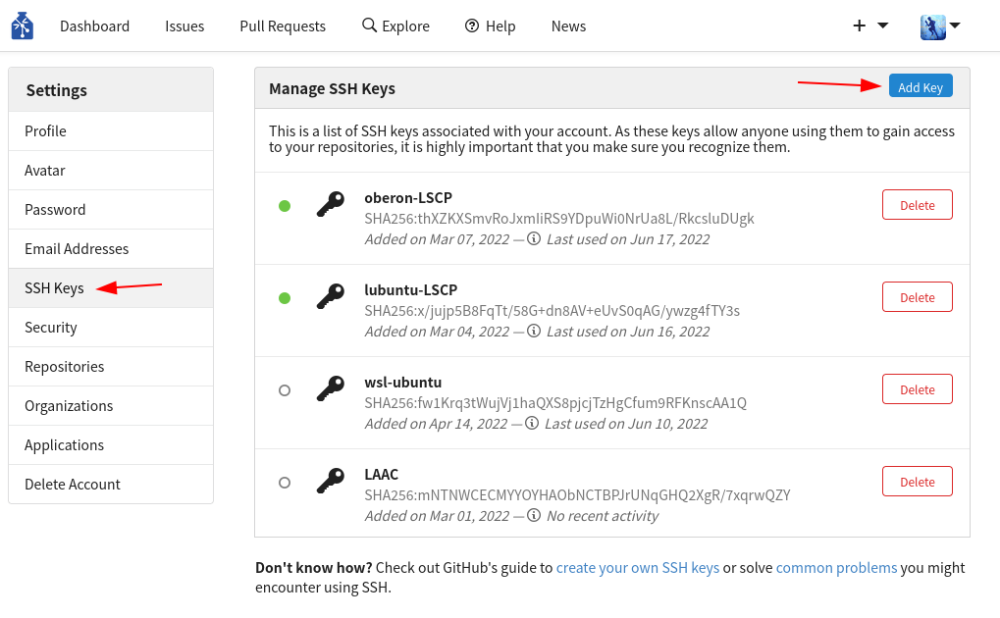
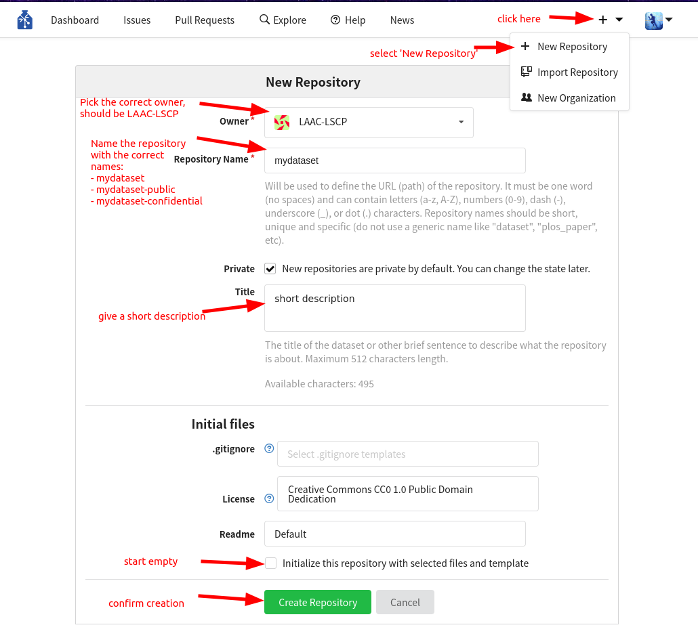

# Creating a Dataset and publishing it to GIN
{: .no_toc }

This page is here to help you create a new Dataset following the ChildProject structure using data that has not been organized this way yet. 

<details open markdown="block">
  <summary>
    Table of contents
  </summary>
  {: .text-delta }
1. TOC
{:toc}
</details>

## Prerequisites

In order to follow this guide, you will need to have childproject installed along with datalad and git-annex. If that is not the case, follow the [installation instructions](https://childproject.readthedocs.io/en/latest/install.html#installation){:target="_blank"}. You most likely will run it in a conda environment, so make sure it is activated:
```bash
conda activate childproject
```

We use GIN as an online platform for storing our repositories, to publish your dataset, you will need a GIN account that has writing permissions for your dataset.
You have to register an SSH key to allow SSH access (you can find an explanation of what SSH keys are and how you can create one in this [tutorial](https://docs.github.com/en/authentication/connecting-to-github-with-ssh/about-ssh){:target="_blank"}). To do this, visit the settings of your user account. On the left hand side, select the tab “SSH Keys”, and click the button “Add Key”:

Give the key an informative name that will allow you to remember what computer it belongs to (eg “oberon-lpeurey”).

## Preparing a GIN repository

We are going to need a new repository on GIN where we will store our dataset and manage people's access to it once it is ready to be shared.
Inside the lab, we regroup our datasets in the LAAC-LSCP GIN organization, so the dataset should be created there. If you have the permissions necessary to create a new repository for the organization, follow the steps in the attached figure, otherwise, discuss with Alex/Loann of your need of a new repository.
If you need a confidential version of the repository, create two *empty* repositories in your GIN organization: `<dataset-name>` and `<dataset-name>-confidential`, e.g. `mydataset` and `mydataset-confidential`.


## Creating the base structure and datalad repository

To create your new dataset, we will borrow some help from the `datalad-procedures` code which was created for this specific pupose. To use it, clone the repo and install it (use python >= 3.6 , if needed call `pip3`, `python3`):
```bash
git clone git@github.com:LAAC-LSCP/datalad-procedures.git
cd datalad-procedures
pip install -r requirements.txt
python install.py
```

At this point, a message may ask you if you want to establish a fingerprint; say yes.

Check the installation with `datalad run-procedure --discover`.
Expected output:
```
cfg_laac1 (/my/conda/env/lib/python3.6/site-packages/datalad/resources/procedures/cfg_laac1.py) [python_script]
cfg_yoda (/my/conda/env/lib/python3.6/site-packages/datalad/resources/procedures/cfg_yoda.py) [python_script]
cfg_el1000 (/my/conda/env/lib/python3.6/site-packages/datalad/resources/procedures/cfg_el1000.py) [python_script]
cfg_text2git (/my/conda/env/lib/python3.6/site-packages/datalad/resources/procedures/cfg_text2git.py) [python_script]
cfg_metadatatypes (/my/conda/env/lib/python3.6/site-packages/datalad/resources/procedures/cfg_metadatatypes.py) [python_script]
cfg_laac2 (/my/conda/env/lib/python3.6/site-packages/datalad/resources/procedures/cfg_laac2.py) [python_script]
```

If the installation went through, `cfg_laac1`, `cfg_laac2` and `cfg_el1000` should be in the list.

We will concentrate on using the el1000 template which is the one we will use most of the time. If its configuration does not suit you, you can explore the other templates available in [the repo](https://github.com/LAAC-LSCP/datalad-procedures){:target="_blank"}.

prepare the necessary parameters by setting the GIN organization you will use and wether to create a confidential sibling or not. If you decide to create a confidential sibling, make sure you created 2 repositories on GIN at [the previous step](#preparing-a-gin-repository)
```bash
export GIN_ORGANIZATION='LAAC-LSCP' # name of the GIN organization
export CONFIDENTIAL_DATASET=0 # set to 1 if there should be a confidential sibling
```
Now we can create the actual datalad repository, the procedure used will build the file structure according to [ChildProject standards](https://childproject.readthedocs.io/en/latest/format.html){:target="_blank"}. Replace `mydataset` my the name of your GIN repository.
```bash
datalad create -c el1000 mydataset
```

The output you'll see looks like this:
```
[INFO   ] Creating a new annex repo at /scratch2/lpeurey/datasets/mydataset/
[INFO   ] Scanning for unlocked files (this may take some time) 
[INFO   ] Running procedure cfg_el1000 
[INFO   ] == Command start (output follows) ===== 
[INFO   ] Could not enable annex remote origin. This is expected if origin is a pure Git remote, or happens if it is not accessible. 
[WARNING] Could not detect whether origin carries an annex. If origin is a pure Git remote, this is expected.  
.: origin(-) [git@gin.g-node.org:/LAAC-LSCP/mydataset.git (git)]
.: origin(+) [git@gin.g-node.org:/LAAC-LSCP/mydataset.git (git)]                       
[INFO   ] Could not enable annex remote confidential. This is expected if confidential is a pure Git remote, or happens if it is not accessible. 
[WARNING] Could not detect whether confidential carries an annex. If confidential is a pure Git remote, this is expected.  
.: confidential(-) [git@gin.g-node.org:/LAAC-LSCP/mydataset-confidential.git (git)]
.: confidential(+) [git@gin.g-node.org:/LAAC-LSCP/mydataset-confidential.git (git)]    
[INFO   ] Configure additional publication dependency on "confidential"         
.: origin(+) [git@gin.g-node.org:/LAAC-LSCP/mydataset.git (git)]
[INFO   ] == Command exit (modification check follows) ===== 
create(ok): /scratch2/lpeurey/datasets/mydataset/ (dataset)
```

The procedure should also carry out the first push to your remote repository(/ies). You should have a look to the online page of your repo on GIN (eg https://gin.g-node.org/LAAC-LSCP/mydataset-confidential)

## Organizing raw data

Your dataset has been created, configured and linked to GIN. But for now,
it has no contents.
The next step is thus to add raw data to the dataset in the right place.

There are two possibilites (depending on whether you created a confidential repository or not):
 1. Some data are confidential and should only be accessible from `<your-dataset>-confidential`
 2. All data can be included in the main version of the dataset

### How confidential data is organized and stored

Here is the rule: every file that is a descendant of a `confidential` folder will be restricted
to users that have read access to `<your-dataset>-confidential`; any other file will
be shared with all users who have read access to your dataset.

Here are a few examples:

#### Files that would be confidential

 - `metadata/confidential/whatever.csv`
 - `annotations/its/confidential/raw/something.its`
 - `annotations/its/confidential/converted/something.csv`
 - `annotations/eaf/confidential/raw/some/annotation.eaf`

#### Files that will not be

  - `metadata/somefile.csv`
  - `annotations/its/raw/something.csv`

It is therefore crucial to organize your data in the right place depending on its level of sensitivity.

### Audio files

TODO : Add information on how to store/convert audio files, best practice, confidentiality.

### Original Metadata

The original metadata is likely to contain sensitive information, so if you have a confidential sibling, it should be restricted to the `confidential` version of the dataset.
Therefore, most of the time, your original metadata should lie in `metadata/confidential/original`. Otherwise, store it in `metadata/original`.

```bash
# cd to your dataset
cd <your-dataset>

# create an empty folder for the original metadata
mkdir -p metadata/confidential/original
```

### LENA annotations

.its annotations contain information that may be used to identify the participants (such as their date of birth). So you should consider storing them as confidential if the participants or te be kept private

```bash
# create an empty folder for the .its
mkdir -p annotations/its/confidential/raw
```

Your .its files should be saved at the root of `annotations/its/confidential/raw` or `annotations/its/raw` depending on if they are to be kept confidential or not.

If you stored them as confidentiel, an anonymized version of the .its should be created. This is done with the [ChildProject package](https://childproject.readthedocs.io/en/latest/annotations.html#its-annotations-anonymization):

```bash
child-project anonymize . --input-set its/confidential --output-set its
```

This may take some time.
Once the command has completed, anonymized .its files should be accessible from `annotations/its/raw`:

```bash
ls annotations/its/raw
123417-0008.its	123461-0713.its	123505-1620.its	123549-2417.its ...
```

### Other data

 - VTC annotations (.rttm files) should be moved to `annotations/vtc/raw`
 - VCM annotations (.rttm files) should be moved to `annotations/vcm/raw`
 - ALICE annotations (.txt files) should be moved to `annotations/alice/output/raw`
 - Any other kind of annotation should be moved to `annotations/<location>/raw/`
 - Other files (documentation, etc.) should be moved to `extra/`

You can create empty folders with `mkdir -p`, e.g. `mkdir -p annotations/vtc/raw`.

### Save and publish

Once all your raw data have been correctly placed in the new dataset, you need to save
the changes and publish them on GIN :

```bash
# save the changes locally
datalad save . -m "message about what changes were made"

# publish
datalad push
```

## Link everything : The new metadata

