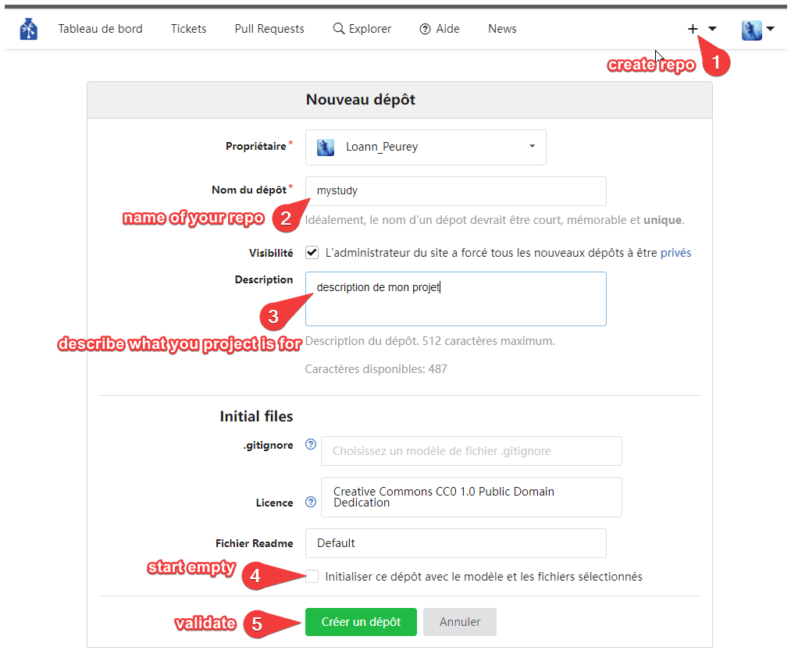

# Creating your own YODA projects, keeping track of changes and publishing your work
{: .no_toc }

<details open markdown="block">
  <summary>
    Table of contents
  </summary>
  {: .text-delta }
1. TOC
{:toc}
</details>

## What is YODA and why you should use it.

The YODA principles are a set of organizational standards for datasets used for data analysis projects. The name stands for “YODAs Organigram on Data Analysis”. The principles outlined in YODA set simple rules for directory names and structures, best-practices for version-controlling dataset elements and analyses. You can read all about them and why they were created in the [datalad handbook](http://handbook.datalad.org/en/latest/basics/101-127-yoda.html){:target="_blank"}.

In our case and in the lab context, we are mainly interested in using them for the following reasons:
- It will keep the original data in a clean state available for every study that requires it. The different versions of this data (eg before and after audio is converted to a standard format) are kept and available.
- Your study, code and analysis is saved and versioned aside the data. The version of the dataset (or datasets as you can nest multiple ones in your project) you are using is saved so that if the data is updated, your work is not affected. You however have the option to update the version you want to use and get the updates if needed.
- You can very easily publish your work to an online repository. This will allow you to archive your work in a safe place but also share it with who you want. Sharing your project this way will greatly facilitate reproducibility of your study as every file needed is easily available, moreover, the scripts ran and the output they produced are memorized and can be easily ran again.

If at some point you feel a bit lost or some instructions are not clear you can:
- Reach out to Loann.
- Follow the [Datalad handbook](http://handbook.datalad.org/en/latest/index.html){:target="_blank"} or the sections that interest you to better understand the way it works.

## Initializing your project repository and the nested datasets

### Create your datalad repository
First make sure that you have datalad and git-annex available. Having your childproject conda environment activated is probably the easiest way to have everything ready to go.
```bash
conda activate childproject
```

When starting a new project, you will first setup a new datalad repository made to comply with YODA.
```bash
cd /directory/of/my/projects # navigate to the directory where you will create your project
datalad create -c yoda mystudy
cd mystudy
```
This will create a new directory mystudy. The procedure `-c yoda` initializes it with a `code` directory where no file is annexed. Every other file in the repo (except config files and README) is considered a largefile and is therefore annexed. You can customize the behaviour of your datalad repo by editing [.gitattributes](http://handbook.datalad.org/en/latest/basics/101-123-config2.html#gitattributes){:target="_blank"}, either at the root of the repo or in subdirectories.
The man page for `datalad create` can be found [here](https://docs.datalad.org/en/latest/generated/man/datalad-create.html){:target="_blank"}.

The next step is to install the datasets you need for your project. Choose where you want to put your datasets, for example here in a dataset directory.

### Getting subdatasets

-----
On oberon with the dataset available locally
{: .label }

When working on the lab server (oberon), you should install your datasets from their local storage scratch1/data/laac_data/ . This will allow you to get largefiles from the local copy, only copying files across the server rather than wasting a huge amount of time downloading them from an online depot.
```bash
mkdir datasets
cd datasets
datalad clone -d .. /store/data/laac_data/mydata/ # for example to install a dataset named mydata
```
`..` points to the root of your project repo

We now have a local dataset linked to our project. However, if one day we publish online and someone was to clone our repository, He would find himself with a reference to a local dataset that doesn't exist in his local machine. This is why we need to change the reference to the online repository to make sure that the data is reachable outside the lab (with the correct authorizations of course).
```bash
cd .. # root of the superdataset
datalad subdatasets -d . --set-property url git@gin.g-node.org:/LAAC-LSCP/mydata.git datasets/mydata
datalad subdatasets -d . --set-property datalad-url git@gin.g-node.org:/LAAC-LSCP/mydata.git datasets/mydata
```
-----
Outside the lab or if the dataset is not present locally
{: .label }

When there is no local dataset storing the data you want, you can directly clone the dataset from an online repo. Just remember that `datalad get` will have to download the content and that can be time consuming.
```bash
mkdir datasets
cd datasets
datalad clone -d .. git@gin.g-node.org:/LAAC-LSCP/mydata.git # for example to install a dataset named mydata
cd mydata
```
-----
### Getting the needed data
Now that your datasets are installed and correctly nested, you will want to access the data files you need. If you have worked with datalad and git annex before, you know that large files content is not present yet, we need to ask datalad to retrieve it for us using `datalad get`.
```bash
datalad get path/to/retrieve # can be files or entire directories
datalad get annotations/*/converted # get all the converted annotations from every set
```
If datalad retrieves your files from the wrong target (eg online instead of from the local dataset), you can use the `datalad get --source NAME` to get from a particular sibling.
The documentation page for `datalad get` can be found [here](http://docs.datalad.org/en/latest/generated/man/datalad-get.html){:target="_blank"}.

-----
Getting updates of the data used
{: .label }

This will allow you to get the new version of the dataset that you are using. It will take the most recent version of that data and update it into your project. Be careful if you already launched analysis on the previous data as the analysis will not match the present data anymore.
If you indeed want to update the dataset, go into the root of the subdataset and use `datalad update`:
```
cd datasets/mydata
datalad update --how=merge
```

-----
### Working on your project

#### Datalad save
When working on your project and modifying its content, you will have to regularly save the current state as a new 'version' of your work. To check wether files have changed (non annexed files content will be checked but for annexed files only their presence will be checked) and modifications are detected, run `datalad status`.

Every time you finished a task (even a small one), you should the current state of your directory using:
```bash
datalad save -m "message about the changes you made to remember what this was about"
```
It is good practice NOT to leave a directory in a dirty state (ie with modifications not saved) at the end of a day. So remember to save it often.

Please try to give a good overview of what is the project in the README.md file and keep it updated. This is important for people that will take interest in the project later.

#### Locked content
An important aspect of datalad/git-annex is that as the content of annexed files is not checked (because they are too large to be versioned), the modification of these files is protected and blocked to make sure that changes to these do not go unnoticed. So if you want to modify their content, you first need to unlock them. That will tell git-annex that this file is allowed to be modified for one thing and then that at the nex `datalad save`, this largefile content will need to be considered the new correct file, effectively being compressed and saved once again as a largefile. So all you need to do is.
```bash
datalad unlock path/myfile
#make the modification necessary
datalad save -m "replaced myfile with new version"
```

#### Running scripts
When running scripts, datalad has a really useful tool fittingly called `datalad run`. This command is made to help you:
- run a script (and then rerun it later easily and help reproducibility)
- keep track of what changes that script made
- protects other files from being unwillingly affected

Instead of running the script yourself, you call `datalad run` who will do it for you, automatically save the recorded changes in the datalad repository and provide the commit code that allows you to rerun the same operation whenever you like.
```bash
datalad run -m "description of what the script does" "python scripts/myscript.py --option 1 argument"
```
To better understand `datalad run` and `datalad rerun`, follow the [datalad handbook guide](http://handbook.datalad.org/en/latest/basics/basics-run.html){:target="_blank"}

### Publishing you project to an online repository
Finally your project will need to be published in a repository online. This is a great way to keep an archive of your work and have a backup besides your local copy.

We will be covering the publishment to a [gin](https://gin.g-node.org/){:target="_blank"} respository as this is the easiest way to store both annexed and not annexed content and we use this platform for most of our datasets. If you wish to use another platform, you can do so and you can have a look at the [guide prepared by datalad](http://handbook.datalad.org/en/latest/basics/basics-thirdparty.html){:target="_blank"}.

First you need to [create a repository on gin](https://gin.g-node.org/repo/create){:target="_blank"}. Go to the + sign and select create new repository


Go to the root directory of your dataset and add your Gin repository as a sibling
```bash
cd /directory/of/my/projects/mystudy
datalad siblings add -d . --name gin --url git@gin.g-node.org:/myname/mystudy.git
```
Check the existing siblings with `datalad siblings`.
The man page for `datalad siblings` can be found [here](http://docs.datalad.org/en/latest/generated/man/datalad-siblings.html){:target="_blank"}.

Now you can push your project to its online repo whenever you want to update the version saved in gin.
```bash
datalad push --to gin
```
On Gin, you will be able to choose who has access to your repository or who can modify its content. Remember that when you give access to your repository, the person will be able to see and download all of *your files* but they will need further authorizations to the data repository itself to see this data.
